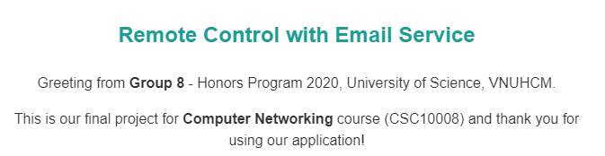

# Remote Control with Email Service

We are from [fit@hcmus](https://www.fit.hcmus.edu.vn/vn/), and this is our final project for Computer Networking course (CSC10008). 

Our app uses Gmail service by Google to allow people to do some kinds of stuff, including getting MAC address, some operations with running app and process, screen and webcam data, and keylogger. Furthermore are some operations with the registry, file manipulations, and even restarting or shutting the device down. 

For more information, follow the contents below.

<span style="font-weight: bold;">Content:</span>
<ul>
    <li>1. <a href="#try-our-app">Try our app</a></li>
    <li>2. <a href="#build-app">Build the app from source codes</a></li>
    <li>3. <a href="#screenshots">Screenshots</a></li>
</ul>

## 1. Try our app
<h5 id="try-our-app"></h5>

Get the latest version of our app by following these steps
```bash
curl -fsSL github.com/htrvu/remote-control-with-email-service/releases/latest/download/G8-Remote-Control.zip -O
unzip -q G8-Remote-Control.zip -d G8-Remote-Control
```

## 2. Build the app from source codes
<h5 id="build-app"></h5>

Firstly, make sure that `python`, `pyinstaller`, and `pyqt5` were installed on your device. Then, follow these steps:

### 2.1. Clone this repository
```bash
git clone https://github.com/htrvu/remote-control-with-email-service
cd remote-control-with-email-service
```

### 2.2. Build the source codes

```bash
cd ./src/ # path to source folder
pyinstaller main.spec

cd .. # path to project folder

mkdir ./G8-Remote-Control
mkdir ./G8-Remote-Control/ui

mv ./src/dist/G8-Remote-Control.exe ./G8-Remote-Control/G8-Remote-Control.exe 
cp -r ./src/ui/assets ./G8-Remote-Control/ui

rm -rf ./src/dist ./src/build
```


## 3. Screenshots
<h5 id="screenshots"></h5>

### 3.1. Home page


### 3.2. Configure before running the app


### 3.3. Pop up notification


### 3.4. Some services shots
* Mail header


* HELP


* MAC get


* APP get


* SCREEN get image


* WEBCAM get video 3


* KEYLOGGER get 15


* REGISTRY get 


* PC shutdown


### 3.5. About us


